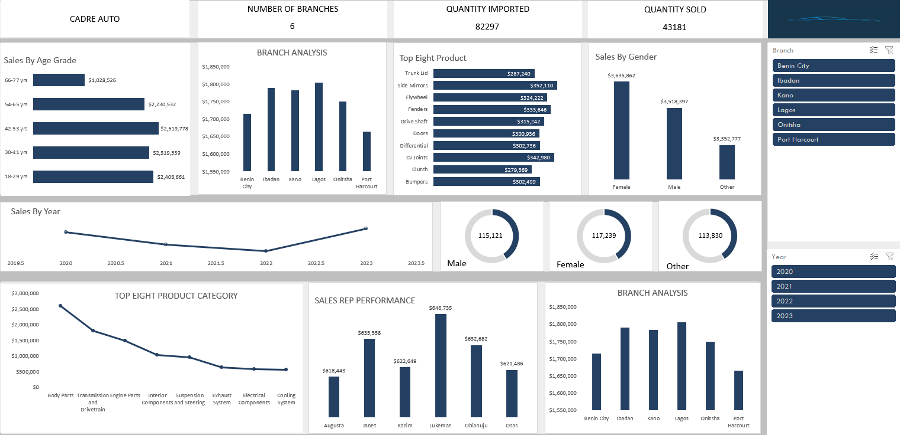
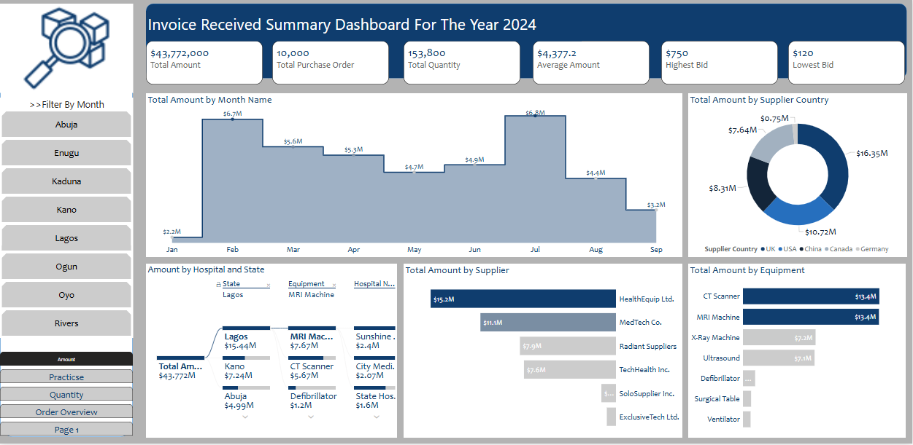

# Portfolio
<!--Section 1: Introduce your self-->
## ABOUT ME

Hello! I'm Humphrey 🤓, a data analyst with a background in process engineering. I specialize in transforming raw data into strategic insights, uncovering trends and patterns to drive informed decision-making. With experience in process engineering, oil and gas operations, sales, and finance, I bring a unique perspective to problem-solving, optimizing systems, improving efficiencies, and leveraging data to unlock business growth.

<!--Mention your top/relevant skills here - core and soft skills-->
## SKILLS

**- ✅ Data Cleaning and Transformation.** 
Proficient in identifying and rectifying inconsistencies, handling missing values, and preparing data for analysis to ensure accuracy and reliability.

**- ✅ Data Handling.**
Skilled in managing large datasets to extract insights and support informed decision-making.

**- ✅ Data Visualization.**
Experienced in creating interactive dashboards using Power BI to drive business insightst and decision-making.

**- ✅ Data Modeling.**
Proficient in designing and optimizing data models in Power BI, including creating relationships, using DAX, and optimizing performance for efficient reporting.

<!--Section 2: List 3-4 key projects-->
## MY PROJECT 

*A glimpse of some of the projects I've been working on.*

**How I helped CADRE AUTO, increase sales by 24% in 6 months**

Data Cleaning and Visualization: **Excel**

<!--[Read More](https://www.linkedin.com/pulse/predictive-modeling-hypothesis-testing-using-titanic-dataset-anietie/)-->

**How I Enhanced Financial Efficiency and Supplier Performance by 50% for a Rig Project.**

On April 15, 1912, during her maiden voyage, the widely considered “unsinkable” RMS Titanic sank after colliding with an iceberg. 

[Read More](https://www.linkedin.com/pulse/predictive-modeling-hypothesis-testing-using-titanic-dataset-anietie/)

**Predictive Modeling and Hypothesis Testing using Titanic Dataset.**

Unfortunately, there weren’t enough lifeboats for everyone onboard, resulting in the death of 1502 out of 2224 passengers and crew. 

<a href="17 How to Present Data to Executives by Anietie Etuk.pdf">Download the Report here (pdf file)</a>

## CONTACT DETAILS

*Let’s connect and see how we can make a difference together!*
<table>
  <tbody>
    <tr>
      <td>📧</td>
      <td><a href="mailto:ezehumphrey22@gmail.com">ezehumphrey22@gmail.com</a></td>
    </tr>
    <tr>
      <td>📞</td>
      <td>(234) 906-930-0804</td>
    </tr>
    <tr>
      <td>📍</td>
      <td>PH, Nigeria</td>
    </tr>
    <tr>
      <td>⬇️</td>
      <td><a href="https://etuk123456.github.io/portfolio1/docs/Profile.pdf">Download my CV</a></td>
    </tr>
    <tr>
      <td>🌐</td>
      <td><a href="https://linkedin.com/in/etukanietie">The things I do daily on LinkedIn</a></td>
    </tr>
  </tbody>
</table>

   

 
